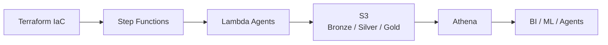
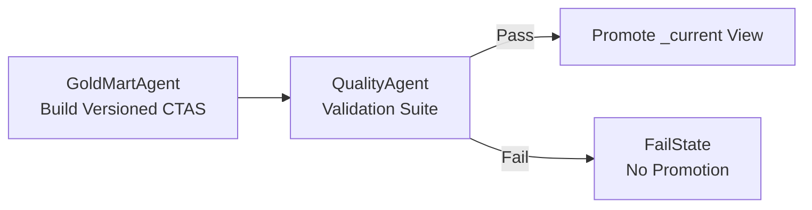

# AWS Hazard & Risk Data Platform

## Overview

Insurance carriers, catastrophe modelers, and climate risk teams rely on
accurate, reproducible hazard and exposure data to make underwriting,
pricing, and capital allocation decisions.

Public hazard datasets (NOAA, FEMA, Census, National Risk Index) are
fragmented, inconsistently structured, and not production-ready for
analytics or modeling.

This project builds a **production-grade, serverless AWS data platform**
that:

-   Standardizes multi-source U.S. hazard data
-   Enforces strict geographic grain integrity
-   Applies deterministic transformations
-   Validates data quality before promotion
-   Produces ML-ready county-level risk feature marts

The result is a reproducible, validation-gated hazard analytics
foundation suitable for underwriting research, catastrophe risk
analysis, and downstream ML modeling.

Infrastructure is provisioned using **Terraform** and orchestrated via
**AWS Step Functions** with Lambda-based operational agents.

Athena Database: `gold_hazard`

---

# Data Sources & Geographic Standardization

This platform integrates multiple public datasets and standardizes them
to a unified analytical grain:

- **Geographic key:** `county_fips`
- **Time grain:** `year`
- **Hazard segmentation:** `hazard_type` (where applicable)

All joins and transformations are explicitly aligned to this canonical
county-year grain to prevent silent duplication or aggregation drift.

## Core Datasets

### NOAA Storm Events Database
- Hazard events (tornado, flood, wildfire, wind, hail, lightning, etc.)
- Fatalities, injuries, property damage
- Event-level time-series data

Used for:
- Hazard aggregation
- Event frequency metrics
- Gold hazard summaries

### FEMA Disaster Declarations + Housing Assistance
- Disaster declaration metadata
- Housing assistance registrants
- Claim counts and assistance amounts

Used for:
- Disaster exposure metrics
- Claim intensity modeling
- County-year insurance impact analysis

### National Risk Index (NRI)
- Expected Annual Loss (EAL)
- Social vulnerability
- Community resilience
- Hazard-specific risk scores

Used for:
- Risk benchmarking
- ML feature engineering
- Baseline comparison against modeled outputs

### US Census ACS 5-Year Estimates
- Population
- Socioeconomic indicators
- Housing characteristics
- Demographic data

Used for:
- Feature enrichment
- Exposure normalization
- Socioeconomic risk segmentation

### ZIP Code to County Mapping (Harvard Dataverse)

Source: https://dataverse.harvard.edu/dataset.xhtml?persistentId=doi:10.7910/DVN/0U2TCB  
Persistent DOI: 10.7910/DVN/0U2TCB  

Used for:
- Mapping ZIP-level records to county FIPS
- Standardizing geographic joins
- Enforcing deterministic allocation logic
- Supporting ZIP-weighted geographic allocation in Silver transformations

All ZIP-level data is deterministically mapped to `county_fips`
prior to aggregation into Gold.

---

# System Architecture



---

# Gold Build & Promotion Flow



This guarantees:

-   Safe deployments
-   Instant rollback
-   Stable BI contracts
-   No broken downstream queries

---

# Storage Layout

```text
s3://<bucket>/
  hazard/
    bronze/
    silver/
    gold/
      <mart>/run_dt=YYYY-MM-DD/
    ops/
```

Gold tables are immutable and versioned.

---

# Medallion Architecture

## Bronze Layer

-   Raw ingestion
-   Immutable storage
-   Minimal transformation
-   Partitioned where applicable
-   Basic rowcount + schema validation

## Silver Layer

-   snake_case normalization
-   Explicit type casting
-   Timestamp parsing
-   Standardized `county_fips`
-   ZIP-to-county deterministic mapping
-   Deduplication on natural keys
-   Partitioning by year
-   Strict grain enforcement
-   Null-grain filtering

All Silver tables enforce deterministic grain integrity before any Gold promotion.

## Gold Layer

Only data from **2010–2023** is allowed in Gold.  
This window is enforced both in CTAS builds and validation gates.

Design principle:

> One row per county per year — no downstream joins required.

Gold marts include:

-   `hazard_event_summary`
-   `risk_feature_mart`

Both are fully ML-ready and analytically stable.

---

# Versioned Physical Tables

Each run creates:

-   `hazard_event_summary__YYYYMMDD`
-   `risk_feature_mart__YYYYMMDD`

These are immutable historical builds.

---

# Stable Views

After validation passes:

-   `gold_hazard.hazard_event_summary_current`
-   `gold_hazard.risk_feature_mart_current`

If validation fails:

-   Promotion is skipped
-   `_current` remains unchanged

---

# Sample Analytics Queries

All queries use stable `_current` views.

## Top 10 Counties by Average Risk

```sql
SELECT county_fips,
       AVG(nri_risk_score) AS avg_risk
FROM gold_hazard.risk_feature_mart_current
GROUP BY county_fips
ORDER BY avg_risk DESC
LIMIT 10;
```

## FEMA Claim Intensity vs Hazard Frequency

```sql
SELECT county_fips,
       year,
       fema_valid_registrations,
       noaa_event_count,
       ROUND(fema_valid_registrations / NULLIF(noaa_event_count,0), 0) AS claims_per_event
FROM gold_hazard.risk_feature_mart_current
WHERE year BETWEEN 2015 AND 2023
ORDER BY claims_per_event DESC
LIMIT 25;
```

---

# Real-World Use Case

## County-Level Underwriting Research

A regional property insurer wants to evaluate whether certain counties
show disproportionate FEMA claim intensity relative to hazard frequency.

Using the Gold data marts:

1.  Analysts examine NOAA hazard event counts.
2.  They compare FEMA valid registrations and total damage.
3.  They calculate **claims-per-event ratios** to identify counties with
    unusually high insurance impact relative to hazard frequency.
4.  Counties with elevated ratios are flagged for underwriting review or
    pricing adjustment.

Because the Gold layer enforces:

-   Strict county-year grain integrity
-   Hard 2010–2023 year window
-   Blocking validation gates
-   Immutable versioned builds

Analysts can trust that results are reproducible and not silently
corrupted by data drift or inconsistent joins.

---

# Data Quality

Blocking validations include:

-   Grain uniqueness enforcement
-   Non-negative metric checks
-   Year window enforcement (2010–2023)
-   County-year coverage validation
-   Deterministic ZIP-to-county mapping validation

Validation failures:

-   Prevent Gold promotion
-   Preserve previous `_current` view
-   Guarantee downstream stability

---

# Design Principles

-   Explicit grains over implicit joins
-   Deterministic builds
-   Hard failure over silent corruption
-   Validation-first engineering
-   Idempotent ETL
-   Agent-based orchestration
-   Cost-aware architecture
-   Stable downstream contracts via `_current` views

---

# Summary

This repository implements a production-style AWS data platform
featuring:

-   Infrastructure-as-Code (Terraform)
-   Serverless orchestration (Step Functions + Lambda)
-   Medallion architecture
-   ZIP-weighted geographic allocation
-   Blocking quality gates
-   Versioned Gold builds
-   Validation-gated promotion
-   Deterministic, reproducible pipelines
-   Cost-aware Athena design
-   ML-ready analytics marts

The system is engineered for reliability, auditability, and safe
iteration - not just data movement.
